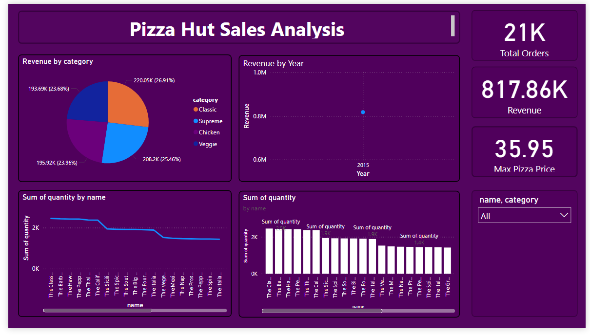

# Power-Bi-Dashboards
# 🍕 Pizza Hut Sales Analysis Dashboard - Power BI

This project presents an interactive **Power BI dashboard** that analyzes Pizza Hut sales data to uncover key business insights. The dashboard is based on transactional data including order details, pizza types, prices, and order timestamps.

---

## 📌 Objectives

The analysis addresses the following business questions:

1. **Total number of orders received**
2. **Total revenue generated from pizza sales**
3. **Identification of the highest-priced pizza**
4. **Top 3 most ordered pizza types by revenue**
5. **Top 5 most ordered pizza types by quantity**
6. **Hourly distribution of orders throughout the day**
7. **Average number of pizzas ordered per day**

---

## 📊 Key Metrics Displayed

| Metric              | Value     |
|---------------------|-----------|
| **Total Orders**    | 21K       |
| **Total Revenue**   | ₹817.86K  |
| **Max Pizza Price** | ₹35.95    |

---

## 🧩 Visuals Used

- 📈 **Line Chart** – Quantity of pizzas sold by name  
- 📊 **Bar Chart** – Top-selling pizzas by quantity  
- 🥧 **Pie Chart** – Revenue share by pizza category  
- 📅 **Scatter Plot** – Revenue by year  
- 🔢 **Cards** – Total orders, revenue, and max price  
- 🔘 **Slicer** – Filter by pizza category  

---

## 📂 Files Included

- `PizzaHut_Sales_Analysis.pbix` – Main Power BI dashboard file  
- `dash.png` – Screenshot preview of the dashboard  

---

## 🛠 Tools & Technologies

- **Power BI**
- **Excel / CSV for data source**
- **SQL (optional, for preprocessing)**

---

## 🚀 How to Use

1. Clone the repo or download the `.pbix` file.
2. Open it in Power BI Desktop.
3. Explore visuals or connect it to your own SQL database if needed.

---

## 📚 Learnings

- Creating KPIs and custom measures in Power BI  
- Using DAX for revenue and average calculations  
- Effective visual storytelling with business data  
- Interactive filtering using slicers and cards  

---

